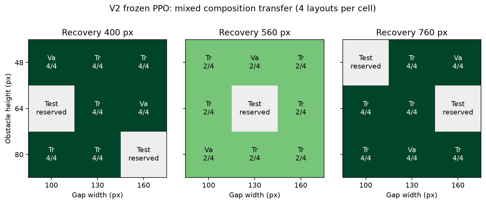

# Mixed v5 几何覆盖与组合迁移

> 本文记录扩展课程时的初始模型基线。后续 gap 修复模型在相同 v5 验证上已达到确定性 24/24、采样 72/72，详情见 [gap 门槛修复](GAP_V2_RECOVERY.md)。保留下面的初始结果用于前后对照。

2026-10-04。课程文件：`config/curriculum_v5.json`；生成器：`ai_platformer/content/curriculum_v5.py`。保留 v4 的全部 434 个布局、内容和 split 归属，新增 120 个布局，总数 554。物理、动作、观测和旧模型协议没有改变。

## 覆盖与组合隔离

新增的主体覆盖 27 个 `(障碍高度, 缺口宽度, 恢复距离)` 单元：

- 高度：48 / 64 / 80 px。
- 缺口宽度：100 / 130 / 160 px。
- 恢复距离：400 / 560 / 760 px，按障碍右缘到缺口起点计算。
- 每个单元有 4 个布局：出生点 32 / 128，障碍距出生点 240 / 420 px。
- 缺口后至终点保留 400 px，便于观察落地；没有加松果或敌人。

| 新增分组 | 组合单元 | 布局数 |
| --- | ---: | ---: |
| train | 16 | 64 |
| validation | 6 | 24 |
| test | 5 | 20 |
| OOD | 3 | 12 |

主体单元按固定索引公式分组，同一组合的所有位置变化留在同一 split。validation/test 的完整组合不在新增 train 中，而各维度的单独取值都在 train 中出现；这使未来训练后的组合泛化评估不再只是位置偏移。OOD 使用高度 88、缺口宽度 180 的新取值。

既有 mixed 的较大间距与新组合一起保留。此次仍为一个障碍、一个缺口，恢复距离大于原生成器 360 px 安全约束；尚未涉及连续多障碍/多缺口或空中衔接。

## 冻结模型的零样本验证

模型是 v2 纯 PPO 重训的 `runs/ppo_gameplay_v2_retrain/checkpoints/best_gap.zip`，保存于 229,376 transition。SHA256 `0cf78b004c31e213ec5e4abd8381614d52824beb56f4a0fdc977af316fe1a833`。评估前校验源 sidecar、hash、旧内容协议及 timestep，再显式切换目标 manifest，保留源物理和全部环境参数。

没有用 v5 训练、调整策略或选择 checkpoint。因此结果是旧模型从单项技能向新组合的零样本迁移，不能宣称已经完成 v5 训练后的组合泛化。原模型 gap 门禁仍未全部通过，此次没有跳过这一限制或修改晋级状态。

| PPO 评估 | 成功数 | 成功率 |
| --- | ---: | ---: |
| 旧 mixed 验证回归 | 30/36 | 83.33% |
| 新 train 布局探针（未用于模型训练） | 52/64 | 81.25% |
| 新组合 validation，确定性 | 20/24 | 83.33% |
| 新组合 validation，随机采样 | 48/72 | 66.67% |

确定性 seed=100；采样 seeds=200/201/202，每个新验证布局 3 局。这些是动作采样种子，不是独立训练模型。未对保留的 test/OOD 运行 PPO。

规则策略在三组评估上均为 100%，直接向右跑均为 0%，卡在障碍并超时。自动测试另外为全部 120 个新增布局提供 v2 规则通关见证，包括保留集的几何可达性检查；这不涉及学习策略的保留集验收。

## 失败模式

新增确定性失败的 12 个 train 探针和 4 个 validation 布局，均为恢复距离 560 px、障碍距出生点 240 px。验证集中按恢复距离分层：

| 恢复距离 | 确定性 | 随机采样 |
| --- | ---: | ---: |
| 400 px | 8/8 | 21/24 |
| 560 px | 4/8 | 11/24 |
| 760 px | 8/8 | 16/24 |

逐物理帧事件探针发现，4 个确定性失败布局都在首次起跳落地后立即二次起跳，此时角色右缘距缺口还有 455 px，随后死亡，未记录第二次落地。这个结果支持“落地后再起跳时机不稳定”的解释，而不是把失败简单归因于缺口宽度。它尚不能证明策略忽略传感器或唯一依赖固定节奏。



图中每格是 4 个布局的成功数，Tr/Va 表示新增 train/validation，灰格不包含模型测试结果。不同 split 的组合数量不同，分层成功率不应当作控制了所有其他因素的因果结论。

## 复现与后续训练入口

```bash
.venv/bin/python -m scripts.generate_curriculum_v5

.venv/bin/python -m scripts.evaluate_mixed_generalization \
  --model runs/ppo_gameplay_v2_retrain/checkpoints/best_gap.zip \
  --manifest config/curriculum_v5.json \
  --output runs/mixed_generalization_v5_recheck.json
```

报告路径需未存在。机器可读摘要：`docs/reports/mixed_generalization_v5.json`。完整逐布局结果、对照、采样诊断和首个失败轨迹：`runs/mixed_generalization_v5_v2.json` 及同前缀 `.failure.json`。确定性跳跃事件：`runs/mixed_generalization_v5_events.json`。

新训练配置 `config/ppo_gameplay_v2_mixed_v5.json` 已解析验证，使用同一已确认物理、原 PPO 参数和 v5 课程；本轮没有启动训练。下一轮先恢复 gap 前置门禁，再进入扩展 mixed，重点学习障碍落地后的继续跑/重新起跳时机，同时保留 obstacle 回放。改变 manifest 后不能严格 `--resume` 旧 v4 run；同物理/网络下可用 `--init-from` 作有记录的权重初始化，但会重置优化器和课程状态。

待训练方案与 checkpoint 选择规则稳定，再进行多训练种子和保留 test/OOD 验收；不能仅因本轮验证均值超过 80% 就视为所有布局合格。
